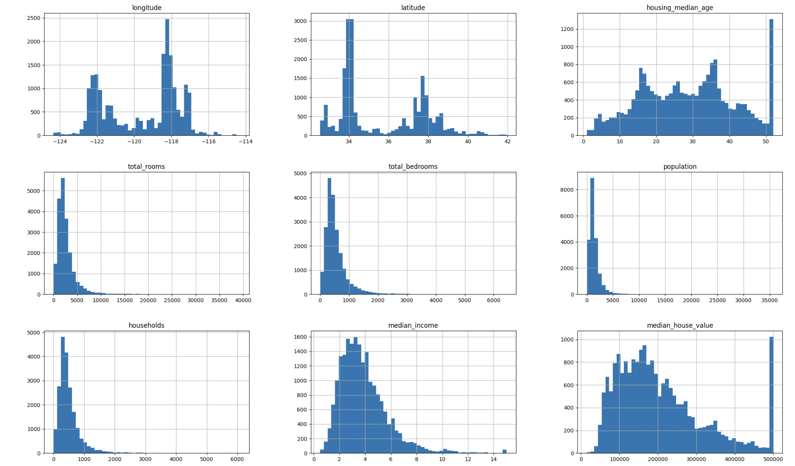
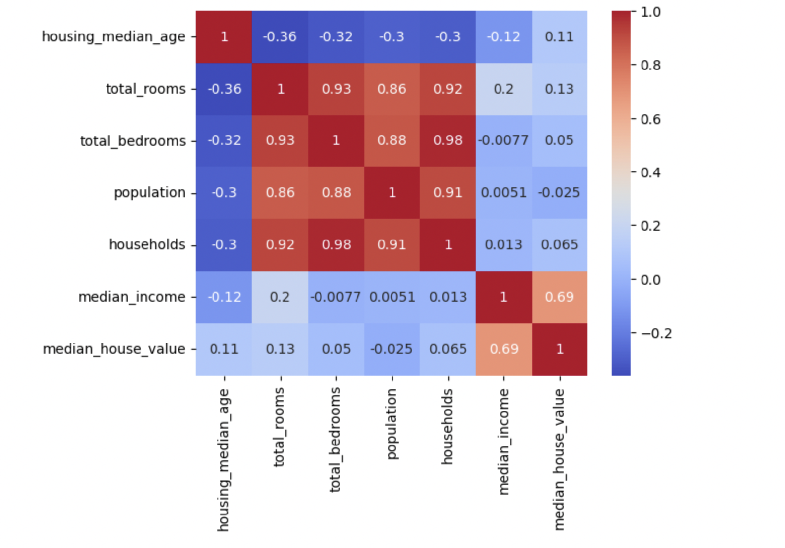
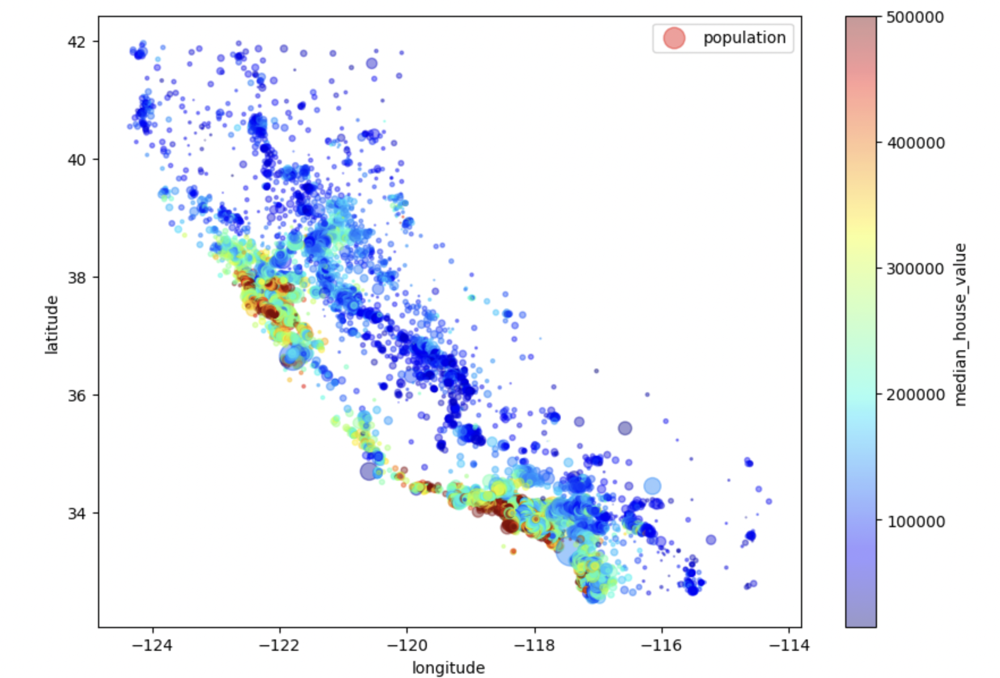

# Housing Price Prediction
This project involves building a housing price prediction model using TensorFlow based on historical housing data from California. 
The goal is to predict housing prices by leveraging various machine learning techniques and neural networks.

## Techniques Used
In this project the following techniques were used: 
- Feature Engineering
- Data Processing
- Data Visualization
- Data Analysis
- Prediction Neural Network

## Tools Used 
- pandas
- numpy
- seaborn
- matplotlib.pyplot
- tensorflow with keras 
- sklearn train_test_split
- python
  
## 1.) Data Extraction 
- The dataset was downloaded locally and imported using pandas.
- Initial Dimensions: 20640 rows × 10 columns

## 2.) EDA (Exploratory Data Analysis)
- Performed operations:
    * info(), describe(), value_counts()
    * isnull().sum()
    * And plotted a histogram for each non categorical feature to view its distribution 
    * Decided to remove rows for all null cells
    * Checked for duplicate rows

      
### Conclusions
- Our "median_house_value" and "housing_median_age" appear to be capped at a limit, shown by the large spike/maximum towards the far right of the histogram
  * Two Solutions:
  *   * Either gather more data from districts that were capped
  *   * Or we can remove those pieces of data from the training set
  * It also appears that the "median_income" column is not scaled normally
  * Its also important to note that many histograms represent a tail heavy distribution
      
## 3.) Data Processing 
- We one hot encoded categorical feature ocean_proximity( we had to turn this into integer values due to tensorflows built in one hot encoder not taking categorical values, later I learned just to use pd.get_dummies or sklearn.OneHotEncoder)
- Decided to discard the capped values which was about 4%
- Created features: 
  * Total rooms per Household
  * Total bedrooms per Household
  * Population per Household
- After processing we are left with Dimensions: 19448 rows x 18 columns

## 4.) Data Visualization 
- Used box plots, histograms, heatmaps, and geographical visualizations to gain insight on the data and understand correlation between features

### Conclusions 

- The only relationship that stands out is the "housing_median_value" vs "median_income". Looking at the scatterplot it may not be immediately obvious but there is a positive correlation between these two values. To verify this relationship I have also visualized a heat map, which proves that the relationship between these two are positive with a value of 0.69. This intuitively makes sense, as the income in that district increases so do the prices of housing.
  
- This is interesting to look at, intuitively housing prices are more expensive near the coast, from what looks like to be Los Angeles and San Fransico. And we can clearly see how densly packed these locations are. The combination of population density and location in these areas could provide significant data when training our predictive model

## 5.) Model Training 
- I used 3 models each increasing in complexity using Min-Max scaling and Standardization as scaling metrics
- and used MAE as an evaluation metric
Here is a run down of each model:

#### Model 1
* 1 Hidden Layer
* 10 epochs
* Standard Gradient Descent as optimzer
* No Change in Learning Rate
* Using MAE
  
#### Results 

- Training MAE for Min-Max Scaled Data : mae: 194457.1719
- Training MAE for Standardized Scaled Data : mae: 194476.5000

- Validation MAE for Min-Max Scaled Data: 191280.67695726274
- Validation MAE for Standardized Scaled Data: 191301.12178081108

- Test MAE for Min-Max Scaled Data: 187720.60654641766
- Test MAE for Standardized Scaled Data: 187741.38188078767

#### Model 2
* 3 Hidden Layers
* Use MAE
* Use 50 Epochs
* Use Activation Function ReLu
* Optimizer Adam
* Learning Rate Adjusted to 0.001

#### Results

- Training MAE for Min-Max Scaled Data : mae: 46323.7383
- Training MAE for Standardized Scaled Data : mae: 42375.3359

- Validation RMSE for Min-Max Scaled Data: 46989.847933260535
- Validation RMSE for Standardized Scaled Data: 44319.95090891572

- Test MAE for Min-Max Scaled Data: 45810.39243344907
- Test MAEfor Standardized Scaled Data: 41427.358076935445
  
#### Model 3
* 5 hidden Layers
* Use MAE
* Use 100 Epochs
* Use Activation Function Leaky ReLu
* Optimizer Adam
* Learning Rate Adjusted to 0.01

#### Results

- Training MAE for Min-Max Scaled Data : mae: 39163.6992

- Training MAE for Standardized Scaled Data : mae: 39061.6719
  

- Validation MAE for Min-Max Scaled Data: 84953.98381294963

- Validation MAE for Standardized Scaled Data: 41837.573873490495
  

- Test MAE for Min-Max Scaled Data: 82049.51392505786

- Test MAE for Standardized Scaled Data: 38149.44042767811

### Conclusions
- Through out the test set, validation set, and training set generally Standard scaling performed better but noticed that compared to Min Max scaling the change in MAE between epochs would be less generally then Standard scaling. So using Min max scaling may give more control over loss between epochs.
- In Conclusion Model 3 performed best while being standardized. But the fact Model 3 performed well when standardized suggests we may need more rigorous models. But interestingly our Min-Max scaled data for model 3 indicates overfitting. 

